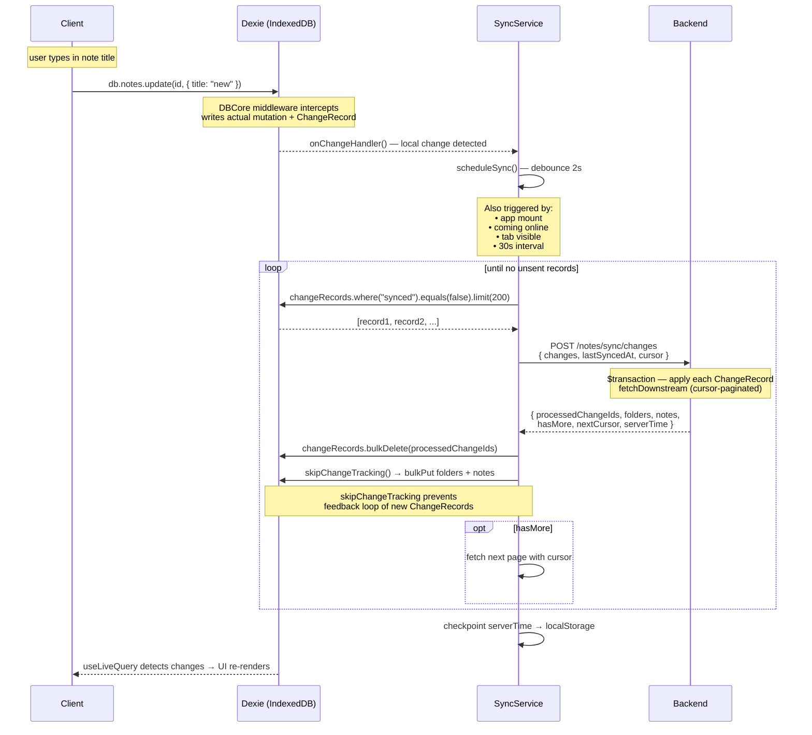

# SyncNotes Frontend

## Syncing Process

The sync engine uses a **change-record-based** protocol. Every local mutation (create, update, delete) is captured by a DBCore middleware at the IndexedDB layer and stored as a lightweight `ChangeRecord`. A background `SyncService` drains these records and sends them to the server. The server processes them and returns any downstream changes from other devices.



### Key design decisions

| Layer | Choice | Why |
|---|---|---|
| Change capture | DBCore middleware | Runs outside transaction scope, no `NotFoundError` |
| Payload format | Delta-only for updates | Title rename = 30 bytes, not 200 KB |
| Sync trigger | Debounced 2s + interval 30s | Responsive without hammering the server |
| Upstream batching | 200 records per request | Drains backlog without blocking |
| Downstream pagination | Cursor-based server-side | Handles initial sync of thousands of notes |
| Conflict handling | Last-write-wins (updatedAt) | Simple, predictable |
| New device sync | Empty changes + epoch lastSyncedAt | Server returns full dataset |
| Deletion | Soft-delete (isDeleted + deletedAt) | Undo support, audit trail |

### Data flow summary

```
Local mutation
  → DBCore middleware captures delta
  → ChangeRecord (synced=false) persisted to IndexedDB
  → SyncService.scheduleSync() debounced 2s
  → POST /notes/sync/changes
  → Server processes changes + returns downstream
  → Processed records deleted from IndexedDB
  → Downstream entities bulkPut into local DB
  → useLiveQuery triggers React re-render
```
